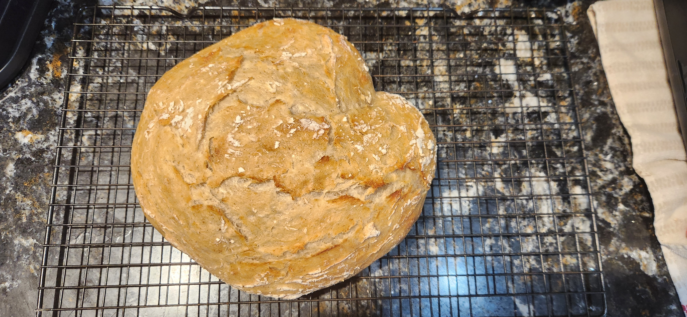

# Bake: 4th of July 2025 sourdough bread bowl

Forth of July bread bowl based on a [loaf](../985) that came out really well. Just sized up a bit more. Forgot my banneton and bread lame. Also was too lazy to add in the [rye berries](../987).

## Ingredients

| Ingredients               | Amount | Bakers % | Comment |
| ------------------------- | ------ | -------- | ------- |
| [All purpose flour](../0) | 500g   | 100%     |         |
| Water                     | 385g   |          |         |
| [rye starter](../741)     | 50g    | 10%      |         |
| salt                      |        |          |         |

## Time log

- 2025-07-04 12:30 autolyse
- 2025-07-04 15:00 Mixed ingredients
- 2025-07-04 22:00 Placed in fridge
- 2025-07-05 15:00 Baked at 500f for 22 minutes. 475 with lid off for 18 minutes. No steam. Used my [usual method](../913)
