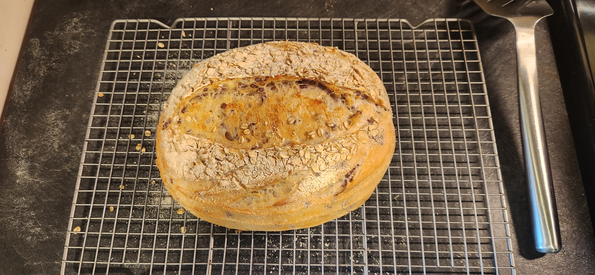

# Bake: Pearled Barley Sourdough Loaf with Lower Hydration

[Baked](../292) today with a modification to the
[White sourdough batard with purple Barley pearls](../985) by lowering the
hydration to improve dough handling and crumb structure.

## Ingredients

| Ingredient                       | Amount | Bakers Percentage | Comment                            |
| -------------------------------- | ------ | ----------------- | ---------------------------------- |
| [Bread flour](../630)            | 450g   | 100%              | [Organic target bread](../1072)    |
| Water                            | 300g   | 66%               | Reduced hydration from last bake   |
| [Pearled barley berries](../987) | 100g   | 22%               | Semi-pearled purple prairie barley |
| [Rye starter](../741)            | 50g    | 7%                | 100% hydration, fed                |
| [Salt](../744)                   | 8g     | 1%                | Sea salt                           |

Total weight is approximately 908g.

## Key events

- 2025-07-24 09:00 Fed starter
- 2025-07-24 13:10 [Autolyse Flour](../911)
- 2025-07-24 15:18 Mixed ingredients
- 2025-07-24 11:00 Shaped and placed in the fridge
- 2025-07-25 12:27 Placed in the [oven](../912)

  Baked with usual [trick](../913) with the [Dutch Oven](../1070) and
  [Cast iron frying pan](../1071). 500f for 21 minutes with lid on, 16 minutes
  with lid off at 450f.

## Retrospect

<!-- Lowering the hydration made the dough easier to handle compared to the previous barley berry loaf. The crumb is slightly denser but more structured. The pearled barley adds a pleasant nutty flavor and texture without excess moisture. -->

## See also

- [Sourdough batard with purple prairie barley](../528)
- [White sourdough batard with purple Barley pearls](../985)
- [Autolyse Flour](../911)
- [Baking index](../292)
