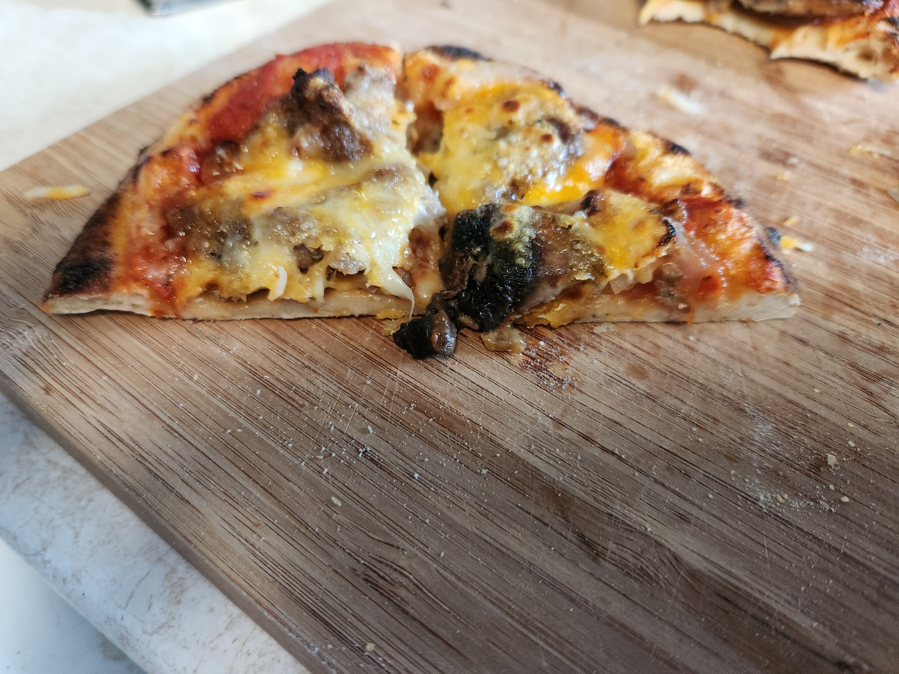
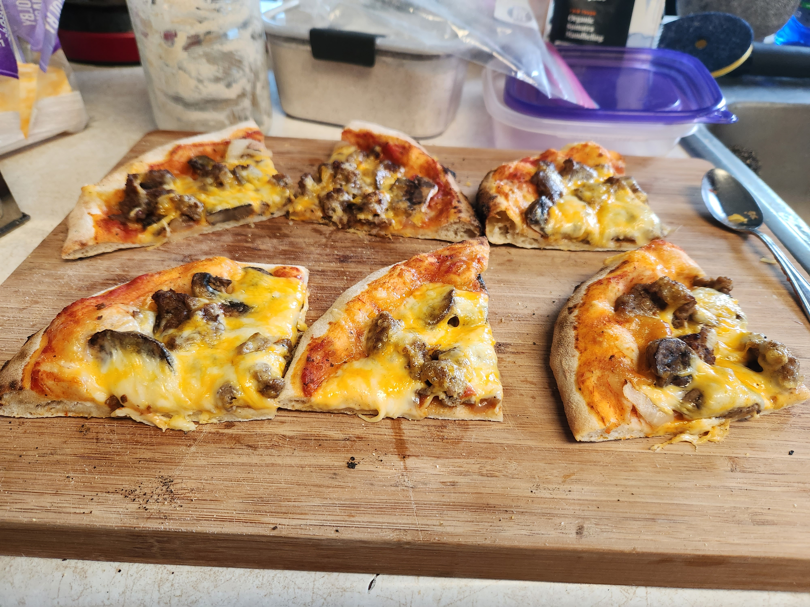

# Sourdough somewhat whole wheat pizza for the ooni

This is a large batch of pizza dough that I made on Sunday August 6th. It is meant to be used in the ooni.

The temperature is a bit cooler than normal. It is 73 as of 12:45pm sunday.

| Ingredient | Weight | Bakers percentage | Comment               |
| ---------- | ------ | ----------------- | --------------------- |
| Preferment | 450g   | 28%               | Around 50g of starter |
| 00 Flour   | 1600g  | 100%              |                       |
| Water      | 930g   | 58%               |                       |
| Salt       | 16g    | 1%                |                       |

Total weight is roughly 3000g. This makes roughly 12 pizzas.

## Key events

- 10:00am Sunday Mixed preferment
- 04:00pm Sunday Mixed pizza dough
- 07:00pm Sunday placed mixed pizza dough into fridge
- 01:15pm Monday Pulled out of the fridge
- 01:45pm Monday Shaped dough balls
- 06:00pm Monday Placed dough balls in freezer
- 07:00pm Monday Baked in the ooni.

  The first was baked at 600f. The other two for 850f. All roughly 3 minutes. Seemed like they where slightliy underbaked. 4 minutes seems to be the ideal when rolling out by hand. The first 2 where left out on the counter top. I grabbed the last one out of the fridge before it was frozen. Made it harder to shape into a disk. Wanted to pull back together.

Overall, the dough was perfect. Pizza came out great.

## See also

- [Baking index](../292)

## Meta

    tags: #baking #pizza
