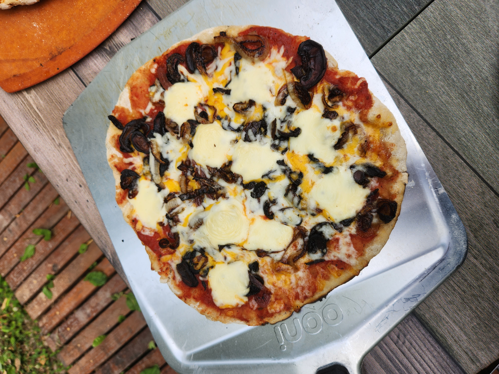
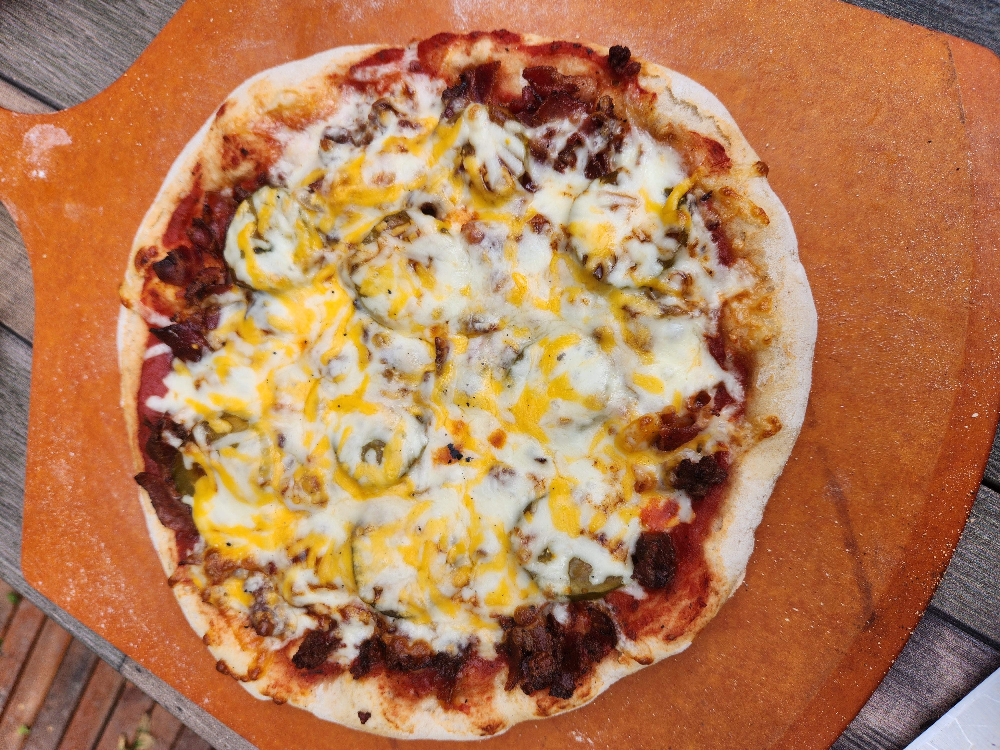

# Bigga sourdough pizza dough Saturday July 22 2023

This is an expermintal pizza dough. This is my first attempt using a [biga](../250).

| Ingredient     | Weight | Bakers percentage | Comment                                              |
| -------------- | ------ | ----------------- | ---------------------------------------------------- |
| Bigga          | 225g   | 45%               | This is with 2g of yeast and a small amount of honey |
| AP Bread flour | 500g   | 100%              |                                                      |
| Water          | 275g   | 55%               |                                                      |

Total weight is roughly 1000g.

Mixed the bigga at around 4pm. At around 10pm I mixed all the ingredients together and placed into the fridge for an overnight proof. I took it out the next morning aroud 10am. It was sticky until like 12pm. Seemed like it would have been perfect by like 2pm. By 4pm it collapsed when I poked it and was super sticky. Probably overproofed. The piza came out fantastic regardless.

## See also

- [Baking index](../292)

## Meta

    tags: #baking
