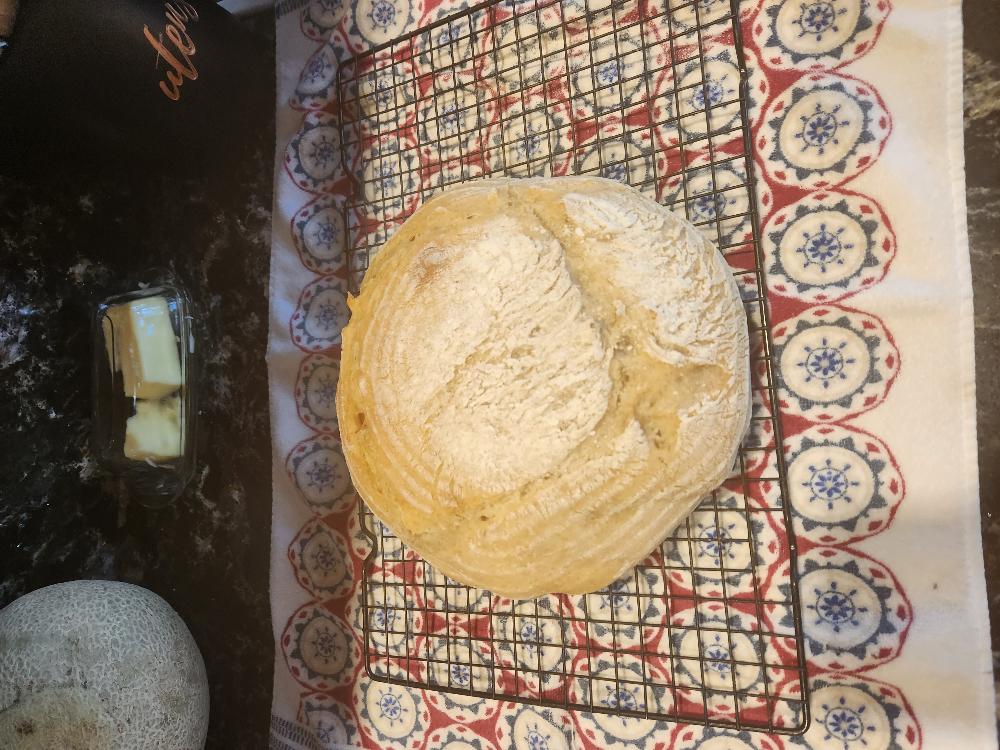

# July fourth weekend 2023 sourdough bread bowl

This is a bread bowl based off of the recipe that I baked on memorial day.

Here are the list of ingredients

| Ingredient        | Amount | Bakers Percentage | Comment                       |
| ----------------- | ------ | ----------------- | ----------------------------- |
| All purpose flour | 550g   | 100%              | organic ap flour from walmart |
| Water             | 375g   | 68%               |                               |
| starter           | 150g   | 27%               | 100% rye 1:1                  |
| salt              | 11g    |                   |                               |

Total weight is 1085g

Here are the key events:

- fed starter at 11am
- mixed at 6pm
- shaped and placed in fridge at 12:30pm
- pulled out of fridge at 8:00pm
- baked at 450g for 24 minutes with the lid on
- baked at 400g for 14 minutes with the lid off

The temperature was roughly 80f.

## See also

- [Baking index](../292)

## Meta

    tags: #baking #holiday #sourdough
    date: 20230-06-30
