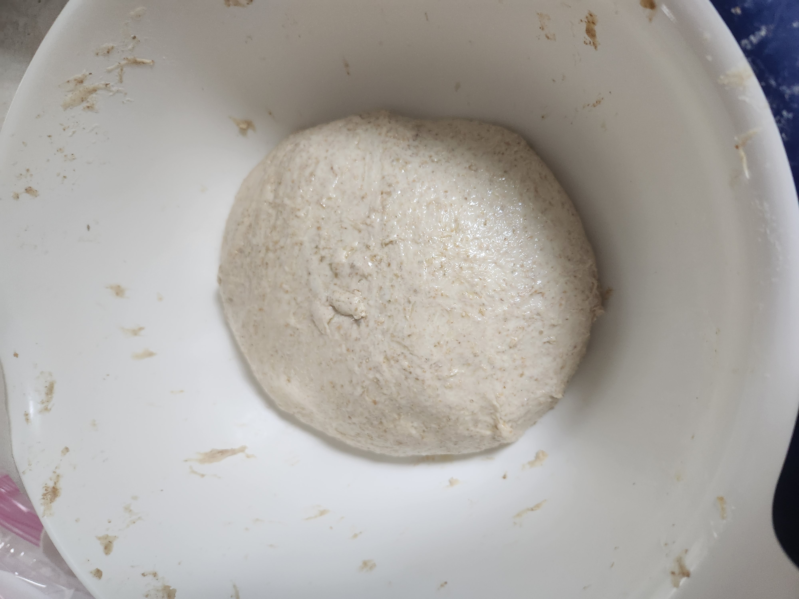

# Large sourdough pizza batch for BYOT pizza event

This is a big batch of pizza dough for the bring your own toppings (BYOT) pizza event at a [friends place](https://zettel.jlrickert.me/422) on Saturday June 24 2023. I plan to base the [recipe](../303) that I had for last time I tried to get a pizza night going.

The temperature today is suppose to get to around 85.

| Ingredient  | Weight | Bakers percentage | Comment                |
| ----------- | ------ | ----------------- | ---------------------- |
| AP Flour    | 1570g  | 80%               | Walmart organic flour  |
| Whole wheat | 400g   | 20%               | Einkorn                |
| Water       | 1300g  | 66%               |                        |
| rye starter | 200g   | 10%               | 100% rye; 1 to 1 ratio |
| Salt        | 20g    | 1%                |                        |

The total weight is 3470. This should be enough for 20 people. I have to work around my schedule so I have to do a few things earlier than I would otherwise.

Here is the planned schedule for the dough:

- Mix starter at 10pm
- Mix at 4:00pm
- Cold bulk ferment from 6:30pm to 10am
- Shaped at 11am

The timings are based off of a recipe at the [perfectloaf] recipe but modified.

The dough came out relatively easy to work with. Was a huge hit with every one.

[perfectloaf]: https://www.theperfectloaf.com/whole-wheat-sourdough-pizza-dough/

## See also

- [Baking index](../292)
