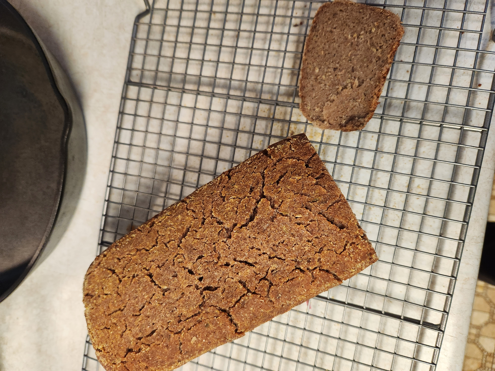

# Experimental rye and barley pullman loaf

| Ingredient       | Weight | Bakers percent | Comments                  |
| ---------------- | ------ | -------------- | ------------------------- |
| Rye              | 300g   | 50%ish         |                           |
| Barley           | 366g   | 50%            |                           |
| 100% rye starter | 50g    | 35%            | 100% rye and kind of weak |
| water            | 500g   | 80%            |                           |

Total weight is 1250 plus caraway and fennel

Made evening of Fri Mar 31 2023. Baked Mid day the next day at 350f for 1.75h. House temperature was less than 60 for bulk fermenting.

## See also

- [Baking index](../292)

## Meta

    Tags: #baking
    Date: Fri Mar 31 2023
