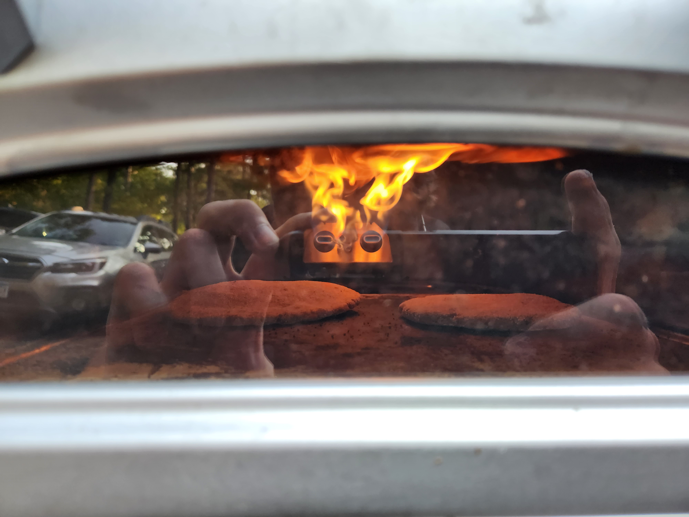

# Sourdough rye and barley pita bread

Sourdough pita bread experiment for a quick batch of pita bread in the [pizza oven](../332).

| Ingredients  | Weight | Bakers percentage | Comment |
| ------------ | ------ | ----------------- | ------- |
| Barley flour | 375g   | 100%              |         |
| Rye starter  | 225g   | 60%               |         |
| Water        | 250g   | 66%               |         |
| EVOO         | 20g    | 5%                |         |

## Key events

- 09:30am Mix Levain
- 11:00pm Mix dough
- 6:00pm Baked at 750f in the ooni

  Each piece of bread is roughly 100g of dough rolled to be relatively thin. I found that baking for roughly 45 seconds on each side seems to be good enough. This gives them enough time to puff up while not being tough. You want them to be soft.

## Retrospect

This comes out relatively heavy with a good note of sourness from the rye. Relatively little work to make a batch. Was still very good the next day. For storing I just threw them in a plastic bag on the counter top.

## See also

