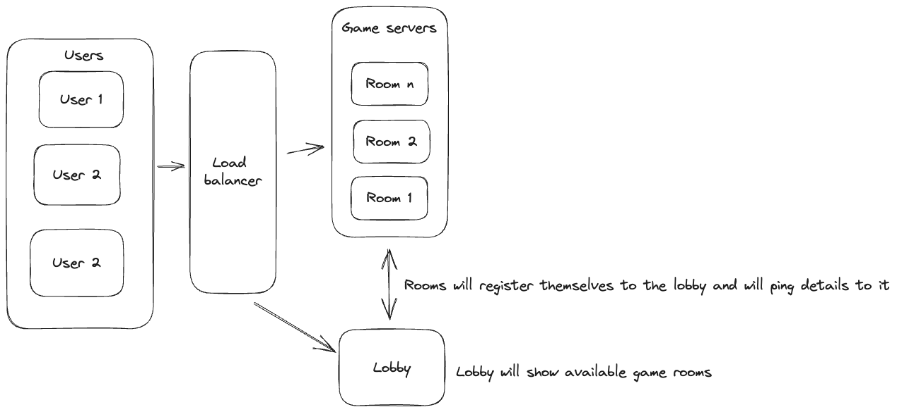
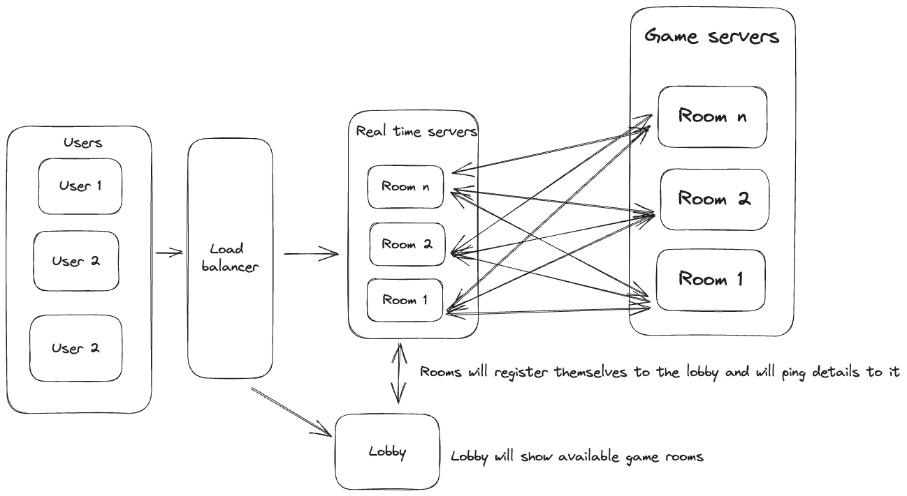

# Battle tanks the game

Battle Tanks is a simple multiplayer game that I am building as a means to learn
about distributed systems and AWS. For production deployment it would be ideal
for game servers to be added and removed based on demand. There should be a
lobby that allows players to find be able to join servers that are available.

Here is the tech stack:

- Sveltekit
- docker containers

## Architecture

For development I prefer being able to develop on my local machine. I plan on
using `traefik` for load balancing and docker compose.




### Iteration 1

First idea that I had. Originally, clients would be redirected to the lobby if
they where not assigned to the server. This is rather simple as the redirecting
based on path is straight forward. Once a client selects the room they will be
sent to the correct room with a room number and some signature from the lobby in
its path. on they will be sent to the correct server by the load balancer. This
turns out to be a bad idea for multiple reasons. This adds complexity to the
load balancer and locks you into what every one you use. Also adds complexity
for redirecting between servers.

### Iteration 2

Iteration 2 is realizing that keeping load balancing simple is the better way to
go. This one adds a series of real time servers that will then connect the
client to the correct server. The lobby will act as a means to coordinate
everything.

### Iteration 3

### Redis dump

- The Web App sends commands over the Web socket
- The Web API enqueues the command on a Redis queue wsin (RPUSH)
- A Worker
  - Pulls the command from the Redis queue wsin (BLPop)
  - Executes the command
  - May push a response to another Redis queue wsout (RPUSH)
- The Web API
  - Pulls a response from the Redis queue wsout (BLPOP)
  - Sends the response back to the corresponding Web socket

## Road blocks

- HMR and initiation spaghetti

  Discovered a pattern to hold state between restarts when using vite. here is
  an example of how I handle redis.

  ```ts
  export const REDIS_SCOPE = "redis";

  type Client = ReturnType<typeof createRedisClient>;

  const createRedisClient = () => {
    const config = getGlobalConfig();
    const client = redis.createClient({
      url: config.redisURI,
    });
    return client;
  };

  export class RedisClient {
    private log: Logger;
    constructor(private redis: Client) {
      this.log = getGlobalLogger().child({ scope: REDIS_SCOPE });
    }
  }

  export const getGlobalRedisClient = (): RedisClient => {
    const client = (globalThis as any)[REDIS_SCOPE];
    if (client) {
      return client;
    }

    const redisClient = createRedisClient();
    const newClient = new RedisClient(redisClient);
    (globalThis as any)[REDIS_SCOPE] = newClient;
    return (globalThis as any)[REDIS_SCOPE];
  };
  ```

When ever id need redis I get a redis client by running `getGlobalRedisClient`

## See also

- https://github.com/redis-developer/pizza-tribes
- https://github.com/suhaildawood/SvelteKit-integrated-WebSocket
