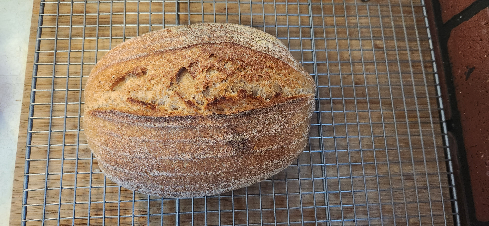

# Sourdough batard

A loaf that I made for myself. The temperature inside is roughly 69f. Same recipe as the last one that I made except I increased the temperature of the oven.

| Ingredient        | Amount | Bakers Percentage | Comment                   |
| ----------------- | ------ | ----------------- | ------------------------- |
| Bread flour       | 232g   | 50%               | King Author 12.7% protein |
| Whole wheat flour | 168g   | 50%               | Hard red wheat berries    |
| Water             | 275g   | 68%               |                           |
| starter           | 40g    | 8%                | 100% rye 1:1              |
| sea salt          | 8g     |                   |                           |

Total weight is roughly 750g.

## Key events

- 2024-01-09 22:00 Mixed starter
- 2024-01-10 13:30 Autolyse
- 2024-01-10 14:45 Mix
- 2024-01-10 22:00 Shaped and placed in fridge
- 2024-01-11 11:15 Baked

  Baked at 475 for 20m in a dutch oven with the lid on and another 18m with the lid off.

## See also

- [last bake](../457)
