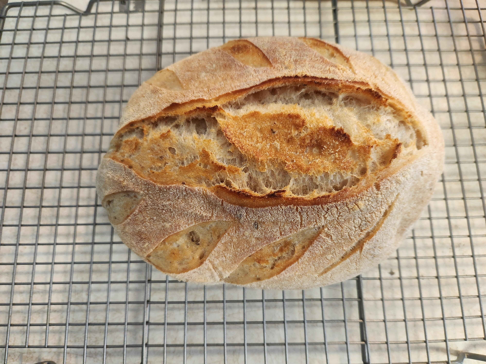

# White sourdough batard

This is a loaf of bread that I made on Tuesday January 16 for myself. It is based on the previous loaf of bread that I baked. The one thing that I changed is that I used all purpose flour instead of whole wheat

| Ingredient | Amount | Bakers Percentage | Comment                   |
| ---------- | ------ | ----------------- | ------------------------- |
| AP flour   | 400g   | 100%              | King Author 11.7% protein |
| Water      | 275g   | 68%               |                           |
| starter    | 40g    | 8%                | 100% rye 1:1              |
| sea salt   | 8g     |                   |                           |

Total weight is roughly 750g.

## Key events

- 2024-01-16 11:00 Autolyse
- 2024-01-16 12:20 Mix
- 2024-01-16 23:30 Shaped and placed into fridge
- 2024-01-17 13:35 Baked

  Baked at 475f for 20m with steam and dutch over with lid on and then another 18m with the lid off. The time for the 18 minute didn't get set so I am not sure how long it was actually baked.

## See also

- [Sourdough batard](../462)