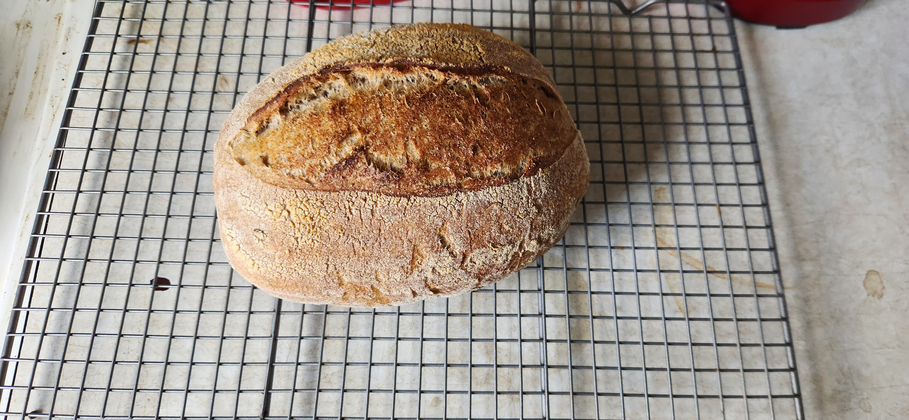

# Basic sourdough batard

| Ingredient        | Amount | Bakers Percentage | Comment                   |
| ----------------- | ------ | ----------------- | ------------------------- |
| AP flour          | 282g   | 62.6%             | King Author 11.7% protein |
| Whole wheat flour | 168g   | 37.3%             | Hard red wheat berries    |
| Water             | 275g   | 61.1%             |                           |
| starter           | 50g    | 11.1%             | 100% rye 1:1              |

Total weight is roughly 810g.

## Key events

- 2024-05-19 11:00 Fed starter
- 2024-05-19 14:37 Mixed ingredients
- 2024-05-19 11:00 Placed in fridge
- 2024-05-20 10:13 Baked

  Preheated to 475f for 30m with the Dutch Oven with the lid off. I spritzed it with water when I put the loaf of bread in the oven. 475f for 20m with the Lid on. Then 475f for 25m with the lid off.

## See also

- [Sourdough batard](../462)