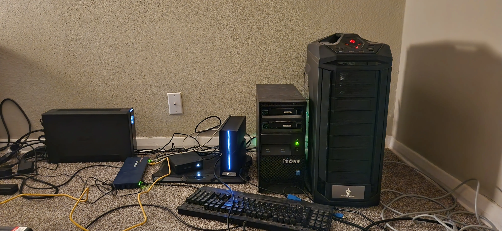

# Project: Current Homelab (homelab)

This is my own personal cloud that I have running on my own hardware.

For an overview of how I have the networks setup see [Network topology](../626).

## Hardware

- [Think Server 140](../563) | ts140.int.jlrickert.me

  This is my [TrueNas](../676) server. This supplies the storage to the [proxmox](../635) server.

- [TP-Link BE550](../685) | be550.int.jlrickert.me

  This is my router

- Modem

- [Trooper](../581) | trooper.int.jlrickert.me

  This runs [proxmox](../635) servers

- [Beelink](../699)

  This is my router, [DHCP](../880), and firewall using [opnsense](../722).

- 16 port unmanaged switch

### Personal devices

- [MBP](../583)
- [XPS](../564)
- [android phone](../612)
- android tablet
- smart TV
- google wiretap

### Planed devices

- Pi 5 for dedicated pi hole
- 3 machine k8s cluster (undecided on hardware)
- NAS box
- 2.5GB switch
- [WiFi upgrade](../639)
- [Beelink EW12 N100](../699) for pfsense (or opnsense) router

### Retired hardware

- [Netgear R7000](../579) | r7000.int.jlrickert.me

  Planning on using as an access point and switch

## Example home labs

- [rwxrobs](../628) [homelab](https://app.excalidraw.com/l/6rjSvoGlOkc/1njNB1sKmj8)
- [Mischa van den Burg](../627) [homelab](https://github.com/mischavandenburg/homelab)

## See also

- [Task to build the homelab](../584)
- [Homelab git repo](https://github.com/jlrickert/homelab)

  Ansible scripts that I use to manage my infrastructure

- [Marionette](https://github.com/jlrickert/marionette)

  My old setup. I no longer use but keep around as a reference

- [Common private networks](../607)
