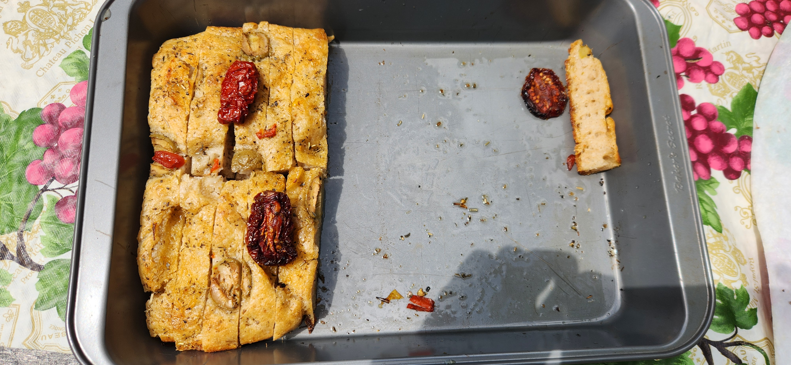

# Baking: Fathers Day Weekend focaccia 2024

Made this for a lunch snack during Memorial Day weekend 2024.

## Ingredients

| Ingredient  | Amount | Bakers Percentage | Comment                  |
| ----------- | ------ | ----------------- | ------------------------ |
| Bread flour | 500g   |                   | King authors bread flour |
| Water       | 400g   |                   |                          |
| starter     | 100g   |                   |                          |
| salt        | 13g    |                   |                          |

Total weight is 1000g

## Time log

- 2024-06-14 07:45 Mixed everything
- 2024-06-14 15:00 Put into fridge
- 2024-06-14 19:00 Pulled out of fridge

  Drove to lake

- 2024-06-14 21:00 Put back into fridge
- 2024-06-15 11:30 Baked

  Baked for 35 minutes. The oven was set to 490f. It is a gas one in a camper. Rotated about every 8 minutes. Forgot to put oil or parchment down before putting the dough down. Ended up [sticking](../592).

## See also

- [Memorial Day Weekend focaccia 2024](../561)