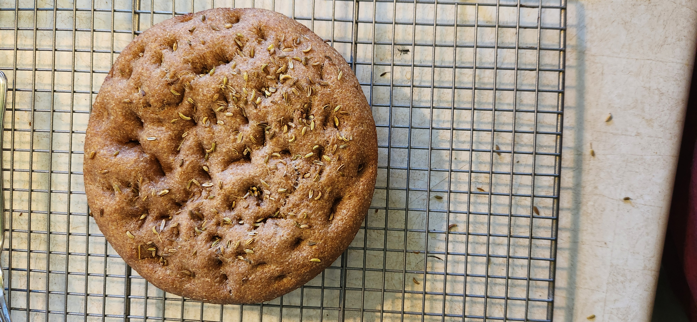

# Bake: Experimental whole wheat focaccia

## Ingredients

| Ingredient                 | Amount | Bakers Percentage | Comment |
| -------------------------- | ------ | ----------------- | ------- |
| [Whole turkey red](../739) | 250g   |                   |         |
| Water                      | 200g   |                   |         |
| starter                    | 50g    |                   |         |
| salt                       | 7g     |                   |         |

## Time log

- 2024-06-29 13:03 Mixed ingredients together
- 2024-06-30 02:00 Placed into the fridge
- 2024-06-30 11:30 Pulled out of the fridge

  Also kneaded it a little bit

- 2024-06-30 12:57 Pulled out of the oven

  Baked for 450f in the small cast iron pan. Worked beautifully. See sticking [issue](../592) for some other things that I tried.