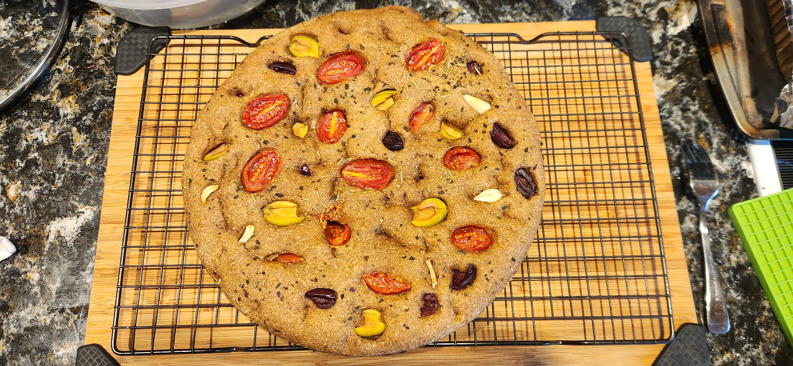

# Bake: Fourth of July focaccia

## Ingredients

| Ingredient        | Amount | Bakers Percentage | Comment              |
| ----------------- | ------ | ----------------- | -------------------- |
| Whole wheat flour | 500g   |                   | [turkey red](../641) |
| Water             | 400g   |                   |                      |
| starter           | 100g   |                   |                      |
| salt              | 13g    |                   |                      |

## Time log

- 2024-07-04 10:24 fed starter
- 2024-07-04 19:45 (mixed ingredients)
- 2024-07-06 11:00 Pulled out of the refrigerator
- 2024-07-06 13:00 Baked
