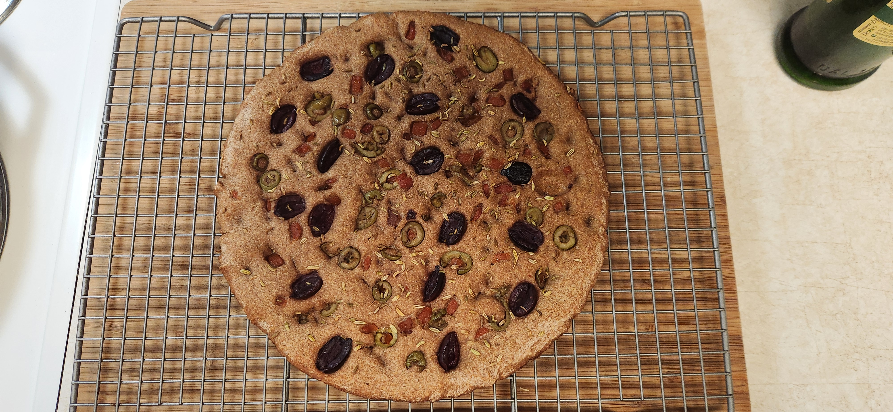

# Bake: Simple whole wheat focaccia

## Ingredients

| Ingredient                 | Amount | Bakers Percentage | Comment |
| -------------------------- | ------ | ----------------- | ------- |
| [Whole turkey red](../739) | 250g   |                   |         |
| Water                      | 200g   |                   |         |
| [rye starter](../741)      | 50g    |                   |         |
| salt                       | 4g     |                   |         |

## Time log

- 2024-07-28 11:23 Mixed ingredients
- 2024-07-28 16:46 Spent some time kneading
- 2024-07-28 22:16 Baked

  450f for 30 minutes in a cast iron skillet.