# Hardware: 42" Flexispot corner raiser

Corner riser that sits on top of a desk to allowing transitioning between sitting and standing. Around 320$ at the [Office Depot]. Cheaper than a full adjustable sizing desk. Keyboard tray takes up quite a bit of room when set the down position. Market seems to average about 50$ all the way up to 150$. 50$ seems to be the most common

[Office Depot]: https://www.officedepot.com/a/products/3578736/FlexiSpot-Height-Adjustable-Standing-Desk-Riser/#Specs

## Specifications

- Gas spring assisted (pneumatic pistons)

- Smooth and controlled assisted lift.
- Maximum height: 19-11/16".
- Weight capacity: 35lb
- Removable keyboard tray
- Top width is 41"
- Top depth is
- Base width is 23"
- Base depth is 23"
- Base depth is 31" with removable tray
- Top depth is 22"
- Top width is 41"
- Top depth with tray is 31"
- Top most corner to bottom corner is 24"
- Top side edges is around 9" with a slight angle

## Photos

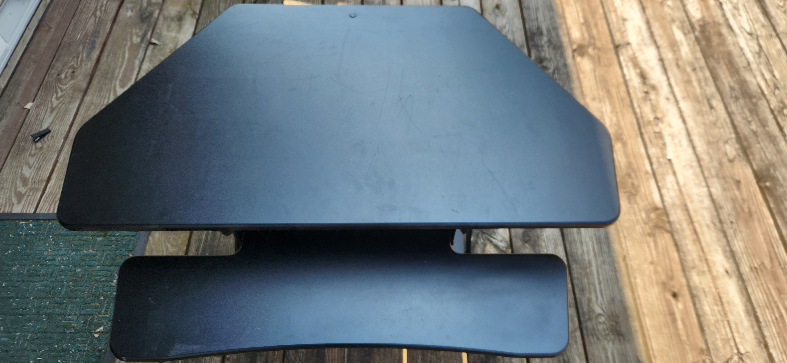

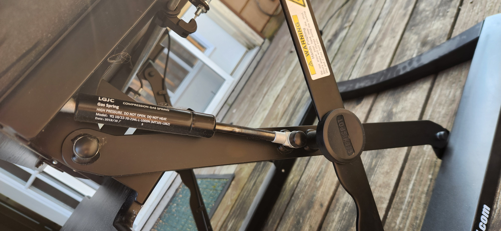

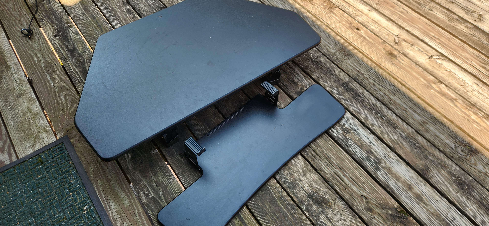

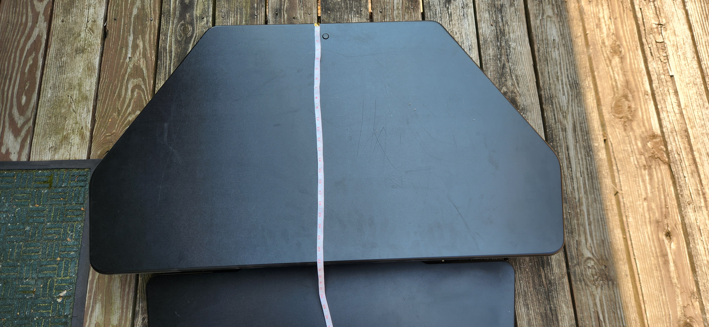

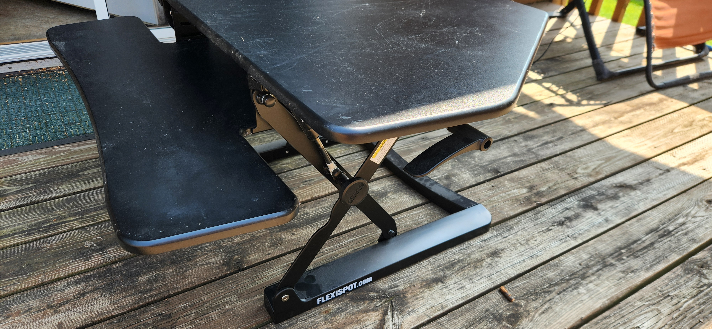

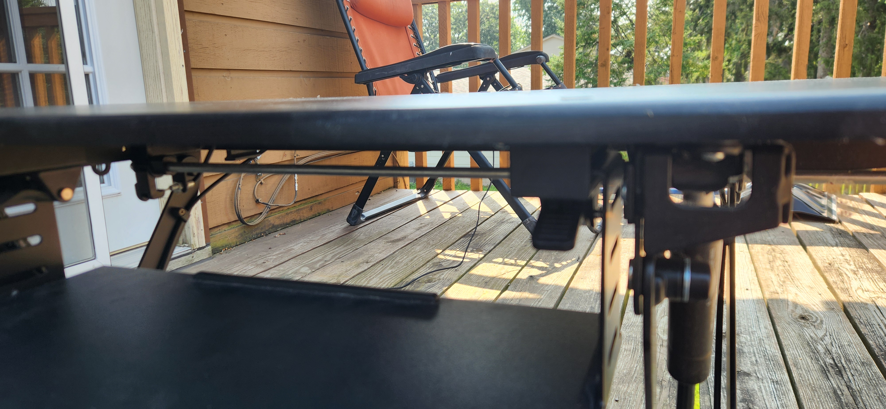

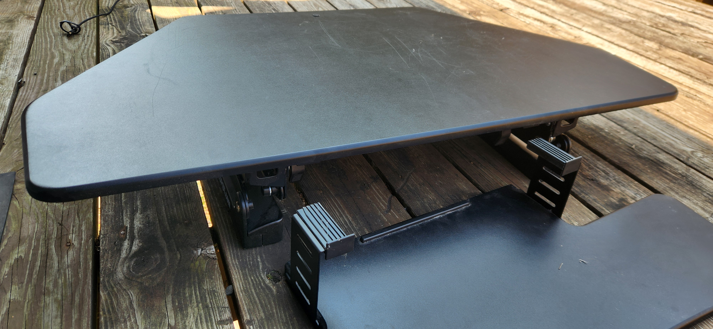

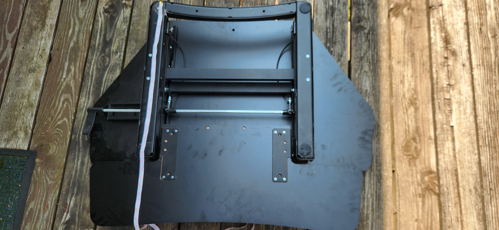

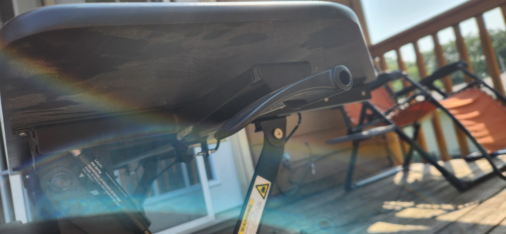

Paddle on both sides that lock the vertical position.

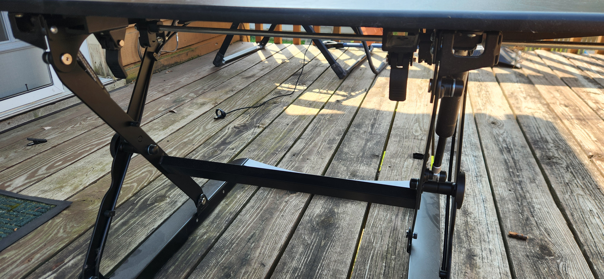

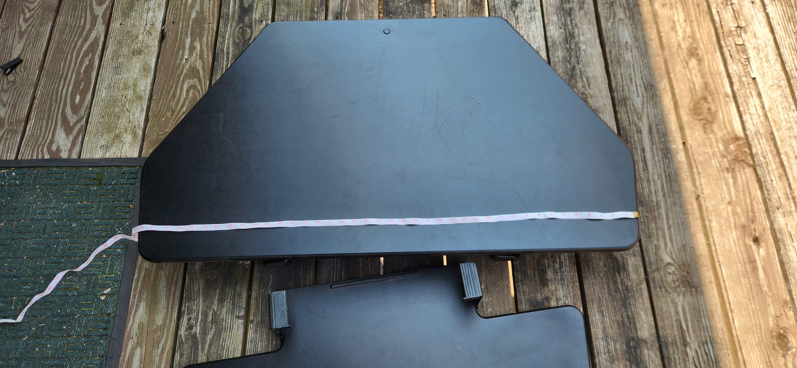

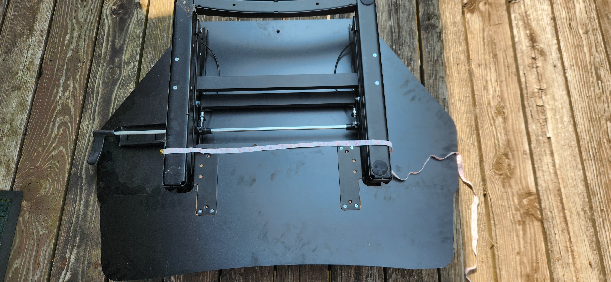
