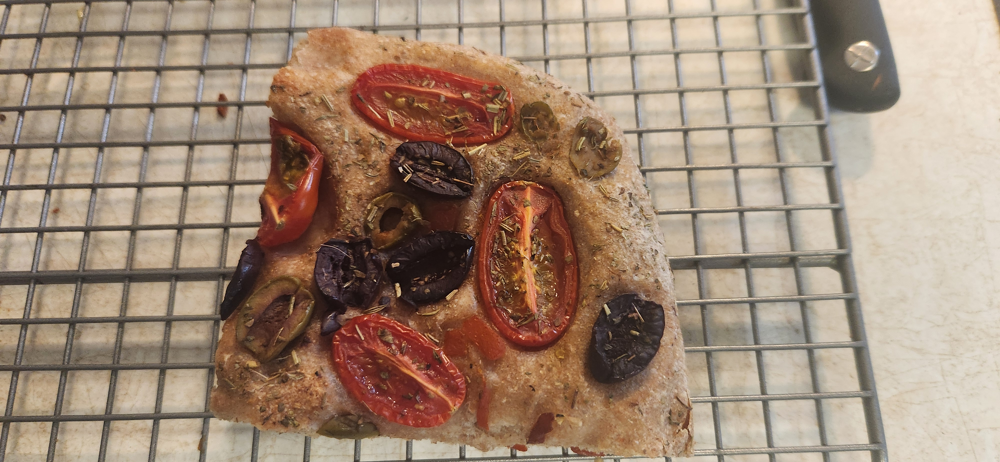

# Bake: Simple half and half focaccia

Focaccia based on the simple whole wheat focaccia [recipe](../738). Increased the weight by 80 grams and replaced a little more than half of the whole wheat to get more rise.

## Ingredients

| Ingredient                 | Amount | Bakers Percentage | Comment |
| -------------------------- | ------ | ----------------- | ------- |
| [Whole turkey red](../739) | 125g   |                   |         |
| [Bread flour](../642)      | 175g   |                   |         |
| Water                      | 230g   |                   |         |
| [rye starter](../741)      | 50g    |                   |         |
| salt                       | 4g     |                   |         |

## Time log

- 2024-08-04 18:27 Mix all the things
- 2024-08-04 23:30 Placed in the fridge
- 2024-08-05 13:32 Baked at 450f for 30 minutes
