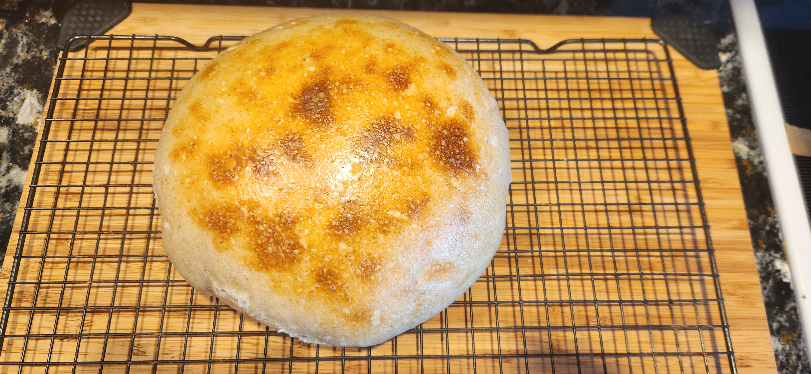

# Bake: Labor day 2024 bread bowl

Bread bowl for labor day. Based on the [recipe](../299) that I used for July fourth 2023.

| Ingredient        | Amount | Bakers Percentage | Comment                        |
| ----------------- | ------ | ----------------- | ------------------------------ |
| All purpose flour | 560g   | 100%              | [King Author AP flour](../630) |
| Water             | 407g   | 68%               |                                |
| starter           | 150g   | 27%               | 100% rye 1:1                   |
| salt              | 6g     |                   |                                |

> [!NOTE]
>
> Bakers percentages are off

## Time log

- 2024-08-30 07:00 Mixed starter. Placed in cooler
- 2024-08-30 18:00 Starter pulled out of cooler
- 2024-08-30 21:23 Mixed Flour and water
- 2024-08-30 23:22 Mixed in Starter
- 2024-08-31 08:52 Pull out of the fridge
- 2024-08-31 15:06 Baked

  18m at 500f with the lid on. 12m with the lid off. Preheated oven to 500f. I had the dutch oven on top of a cast iron skillet. I put a little bit of water in the dutch oven before I put the load inside. I put them in the preheated oven cold.