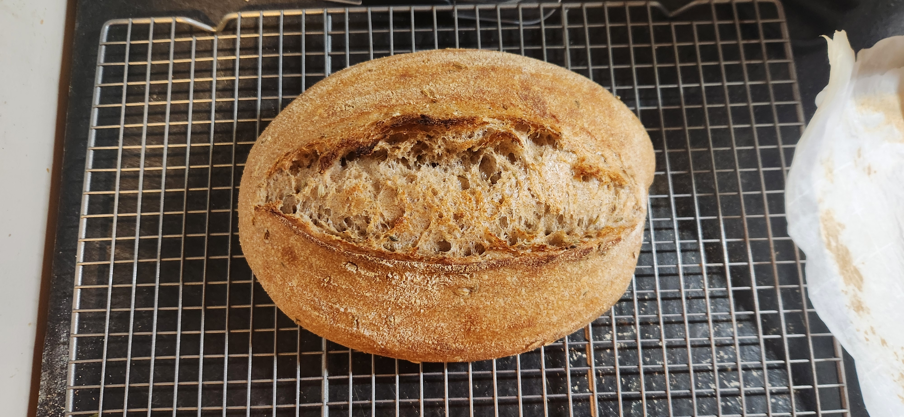

# Bake: Whole wheat 50/50 sourdough batard

Recipe base on [817](../817)

| Ingredient        | Amount | Bakers Percentage | Comment                             |
| ----------------- | ------ | ----------------- | ----------------------------------- |
| Bread flour       | 232g   | 58%               | [King Author 12.7% protein](../642) |
| Whole wheat flour | 168g   | 42%               | [Turkey red wheat berries](../739)  |
| Water             | 275g   | 69%               |                                     |
| starter           | 40g    | 10%               | 100% turkey red 1:1                 |
| sea salt          | 8g     | 02%               |                                     |

Total weight is roughly 750g.

## Time log

- 2024-10-22 10:00 Mix starter
- 2024-10-23 08:21 Mix flour and whole wheat
- 2024-10-23 09:56 Mix all the things
- 2024-10-23 15:00 Shaped
- 2024-10-23 20:38 Baked

  500f for 30 minutes. Baked in dutch oven on top of a cast iron skillet