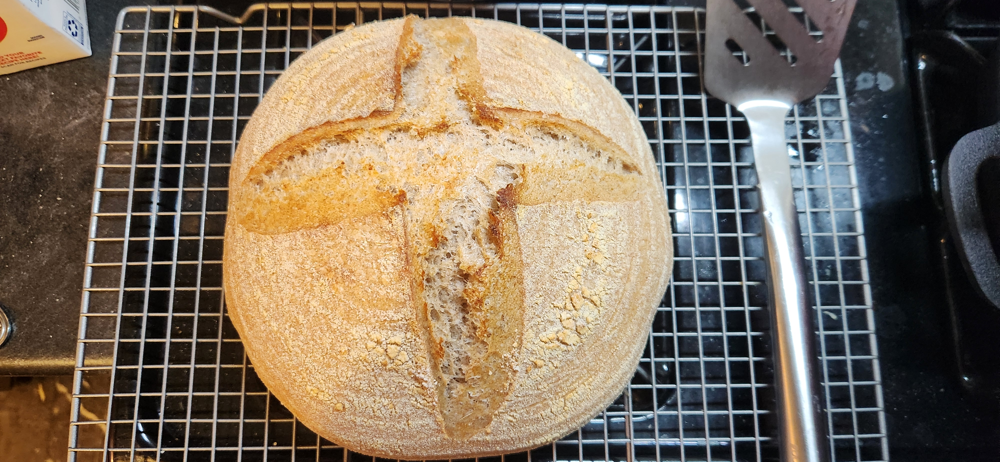

# Bake: large 80/20 sourdough bowl

A tweak on the [labor day 2024 bread bowl](../827).

| Ingredient                  | Amount | Bakers Percentage |
| --------------------------- | ------ | ----------------- |
| [All purpose flour](../630) | 558g   | 80%               |
| [Turkey red](../739)        | 140g   | 20%               |
| Water                       | 474g   | 68%               |
| starter                     | 80g    | 11%               |
| salt                        | 10g    |                   |

Total weight is 1250g.

## Time log

- 2024-10-28 08:45 Mixed starter
- 2024-10-28 12:31 Mixed flour and water
- 2024-10-28 13:38 Mixed rest of ingredients
- 2024-10-28 20:00 Shaped
- 2024-10-29 22:30 Placed in fridge
- 2024-10-29 07:15 Baked

  500f for 24m with lid on and 450f for 14m with lid off. Used the dutch oven with cast iron skillet underneath