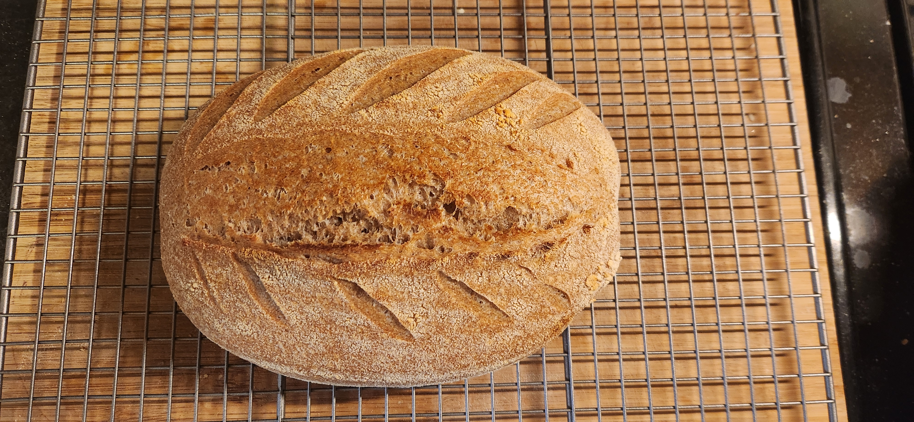

# Bake: Generic weekend sourdough

| Ingredient                  | Amount | Bakers Percentage |
| --------------------------- | ------ | ----------------- |
| [All purpose flour](../630) | 268g   | 60%               |
| [Turkey red](../739)        | 178g   | 40%               |
| Water                       | 303g   | 68%               |
| starter                     | 40g    | 11%               |
| salt                        | 6g     | 1.5%              |

Total weight is 795g.

## Time log

- 2024-11-02 16:14 Mixed dry ingredients
- 2024-11-03 28:30 Mixed rest of ingredients
- 2024-11-02 22:00 Shaped
- 2024-11-03 01:00 Placed in fridge
- 2024-11-03 11:30 Baked

  500f for 20m with lid on and 450f for 12m with lid off. Used the dutch oven with cast iron skillet underneath
