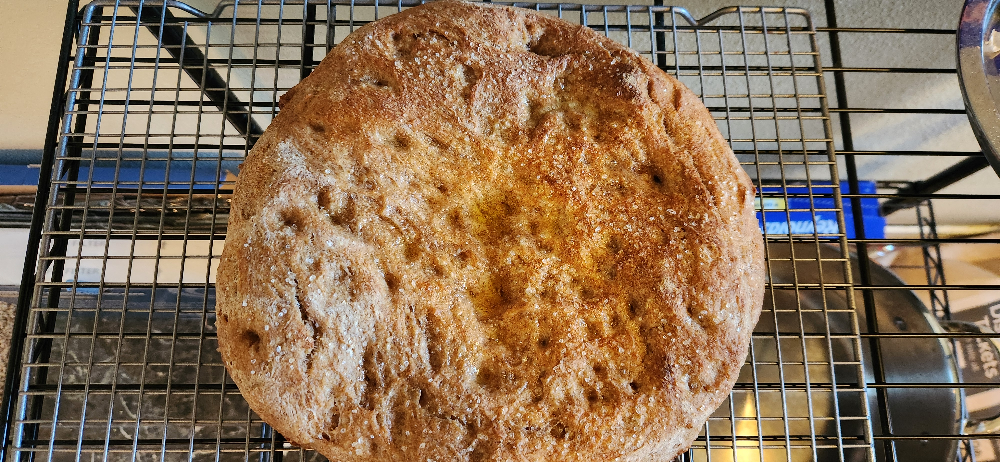

# Bake: Generic weekend sourdough ~batard~ focaccia

A remake of the [batard](../870) that I made a few weeks back. Turned it into a focaccia because I forgot to through it in the fridge.

| Ingredient                  | Amount | Bakers Percentage |
| --------------------------- | ------ | ----------------- |
| [All purpose flour](../630) | 268g   | 60%               |
| [Turkey red](../739)        | 178g   | 40%               |
| Water                       | 303g   | 68%               |
| starter                     | 40g    | 11%               |
| salt                        | 6g     | 1.5%              |

Total weight is 795g.

## Time log

- 2024-11-16 11:00 Fed [starter](../741)
- 2024-11-16 17:17 Autolyse ingredients
- 2024-11-16 18:24 Mixed in starter
- 2024-11-17 10:14 Baked

  500f in the cast iron skillet for 500f
