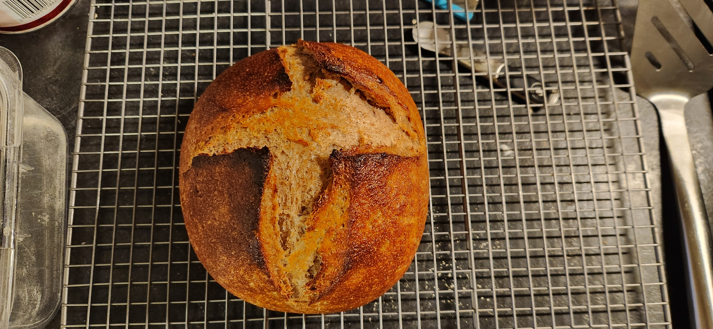

# Bake: More Rye-Based Sourdough Loaf

This rye-forward loaf is an adaptation of the [labor day 2024 bread bowl](../827). A bit of an experiment as I haven't made one in a while. The recipe emphasizes a higher proportion of rye flour to develop a distinct flavor and texture, perfect for rye enthusiasts.

Initial ingredients

| Ingredient                  | Amount | Bakers Percentage | Comment                            |
| --------------------------- | ------ | ----------------- | ---------------------------------- |
| [Rye flour](../740)         | 193g   | 17.5%             | Stone-ground rye flour             |
| [All purpose flour](../630) | 392g   | 70%               | Used to balance the structure      |
| Water                       | 355g   | 74%               | Adjust water depending on humidity |
| starter                     | 180g   | 31%               | 100% rye 1:1                       |
| salt                        | 9g     | 1.6%              | Sea salt for flavor enhancement    |

Total weight is approximately 1100g.

> [!TIP]
>
> Due to the high rye content, the dough may be stickier. Trust the process and adjust hydration if needed.

## Time log

- 2024-12-15 10:00 Mixed starter
- 2024-12-15 16:18 [Autolyse](../911) flour

  30g short of Rye flour. Too lazy to make more right now. Going to add 30g more starter. Also added 20g more water as it was really dry. I updated the ingredients table.

- 2024-12-16 00:00 Placed into the fridge
- 2024-12-16 00:00 Pulled out of the fridge
- 2024-12-16 15:33 Baked
