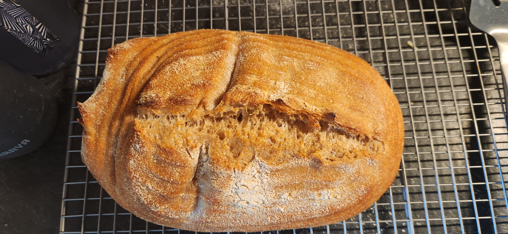

# Bake: 50/50 Wheat Sourdough Loaf

This is a recipe for a smaller 50/50 loaf using equal parts all-purpose flour
and whole wheat flour.

Forgot to put it in the fridge before I went to bed and ended up over proofing

## Ingredients

| Ingredient        | Amount | Bakers Percentage | Comment                  |
| ----------------- | ------ | ----------------- | ------------------------ |
| bread flour flour | 300g   | 60%               | [King Arthur](../630)    |
| Whole wheat flour | 200g   | 40%               | Hard red wheat           |
| Water             | 350g   | 70%               | Adjust based on humidity |
| Starter           | 50g    | 10%               | 100% hydration, fed      |
| Salt              | 5g     | 1.0%              |                          |

Total weight is approximately 905g.

## Key Events

- 2025-01-26 09:00 Fed [starter](../741).
- 2025-01-26 12:30 Mixed the dough.
- 2025-01-26 13:15 Mixed in the
- 2025-01-26 20:29 Shaped
- 2025-01-27 11:24 Baked

  Using the [cast iron trick](../913). 500f for 35 minutes.

## See Also

- [Baking index](../292)
