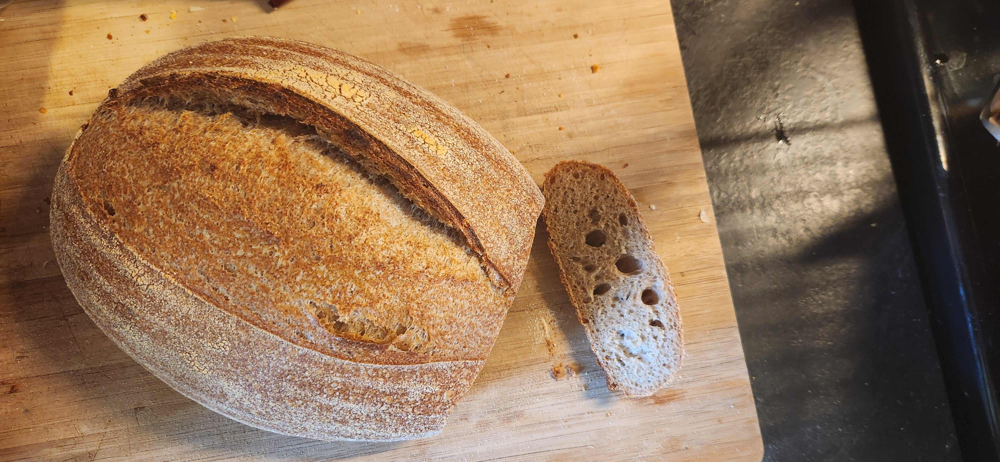

# Bake: 50/50 Sourdough Loaf

This is a recipe for a 50/50 sourdough loaf using equal parts all-purpose flour and whole wheat flour.

## Ingredients

| Ingredient        | Amount | Bakers Percentage | Comment                  |
| ----------------- | ------ | ----------------- | ------------------------ |
| Bread flour       | 300g   | 60%               | [King Arthur](../642)    |
| Whole wheat flour | 200g   | 40%               | Hard red wheat           |
| Water             | 350g   | 70%               | Adjust based on humidity |
| Starter           | 50g    | 10%               | 100% hydration, fed      |
| Salt              | 5g     | 1.0%              |                          |

Total weight is approximately 905g.

## Key Events

- 2025-02-10 09:00 Fed starter.
- 2025-02-10 13:48 [Autolyse flour](../911)
- 2025-02-11 08:30 Placed into fridge
- 2025-02-11 12:00 Baked at 500f using the standard technique with the dutch oven and cast iron skillet.

## See Also

- [Baking index](../292)
