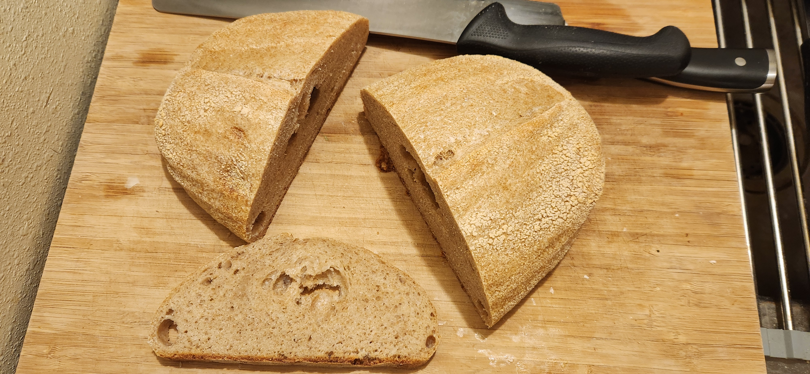

# Bake: 80/20 sourdough loaf

A more white loaf based on the [loaf](../958) that I made last week.

The kitchen was roughly 64f.

## Ingredients

| Ingredient              | Amount | Bakers Percentage | Comment                  |
| ----------------------- | ------ | ----------------- | ------------------------ |
| Bread flour             | 400g   | 80%               | [King Arthur](../642)    |
| Whole wheat flour       | 100g   | 20%               | Hard red wheat           |
| Water                   | 350g   | 70%               | Adjust based on humidity |
| [wheat starter](../742) | 50g    | 10%               | 100% hydration, fed      |
| Salt                    | 5g     | 1.0%              |                          |

Total weight is approximately 905g.

## Time log

- 2025-02-19 10:35 Fed starter
- 2025-02-19 15:05 [Autolyse ingredients](../911)
- 2025-02-19 17:30 Mixed rest of the ingredients
- 2025-02-19 17:50 Couple of stretch and folds
- 2025-02-19 23:00 Stretch and fold, shaped and placed in fridge
- 2025-02-20 14:45 removed from fridge
- 2025-02-20 15:24 Placed into the oven

  Preheated to 500f. Maybe around 30m to heat up the [dutch oven](../963). Baked at 500f for 20m with lid on. Another 12m for 450 with the lid off. Was using the [trick](../913) with the [frying pan](../964).