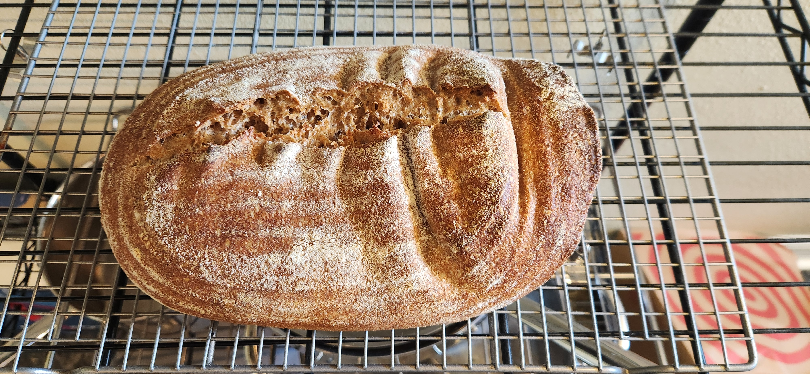

# Bake: 54/46 sourdough loaf

A mostly whole wheat loaf. Didn't have enough whole flour ground up to make the 80/20 that I wanted.

The kitchen is roughly 60f. Forgot to throw in the fridge but still turned out good

## Ingredients

| Ingredient            | Amount | Bakers Percentage | Comment                    |
| --------------------- | ------ | ----------------- | -------------------------- |
| Bread flour           | 229g   | 46%               | [King Arthur](../642)      |
| Whole wheat flour     | 271g   | 54%               | [Turkey red wheat](../739) |
| Water                 | 350g   | 70%               | Adjust based on humidity   |
| [rye starter](../741) | 50g    | 10%               | 100% hydration, fed        |
| Salt                  | 5g     | 1.0%              |                            |

Total weight is approximately 905g.

## Time log

- 2025-03-12 09:00 Fed starter
- 2025-03-12 12:06 [Autolyse Flour](../911) ingredients
- 2025-03-12 13:30 Mixed

- 2025-03-12 12:30 Shaped
- 2025-03-13 09:30 Baked using my usual [trick](../964). Preheated to 550 for 30 minutes. Baked for 475f for 20m with lid on. 450f for 18m
