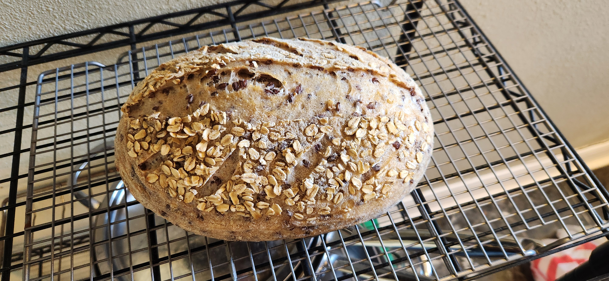

# Bake: White sourdough batard with purple Barley pearls

An experimental high hydration sourdough bread with [purple barley pearls](../987). Only 77% hydration but much high due to addition water from the parley pearls.

37% humidity and 61f.

## Ingredients

| Ingredient                            | Amount | Bakers Percentage | Comment                 |
| ------------------------------------- | ------ | ----------------- | ----------------------- |
| [Bread flour](../642)                 | 450g   | 100%              | [King Arthur](../642)   |
| [Purple Praire Barley pearls](../987) | 100g   | 20%               | [Purple Barley](../987) |
| Water                                 | 350g   | 77.0%             |                         |
| [rye starter](../741)                 | 50g    | 10%               | 100% hydration, fed     |
| Salt                                  | 5g     | 1.0%              |                         |

Total weight is approximately 965g.

## Time log

- 2025-03-24 08:30 Fed starter
- 2025-03-24 12:26 Autolyse
- 2025-03-24 13:21 Mixed ingredient together
- 2025-03-25 20:00 Shapped
- 2025-03-24 22:00 Placed in fridge
- 2025-03-25 10:13 Baked at 500f for 21m and 15m at 450f with lid off. Used the [trick](../913) with the [cast iron frying pan](../964). Used [gas oven](../912).
