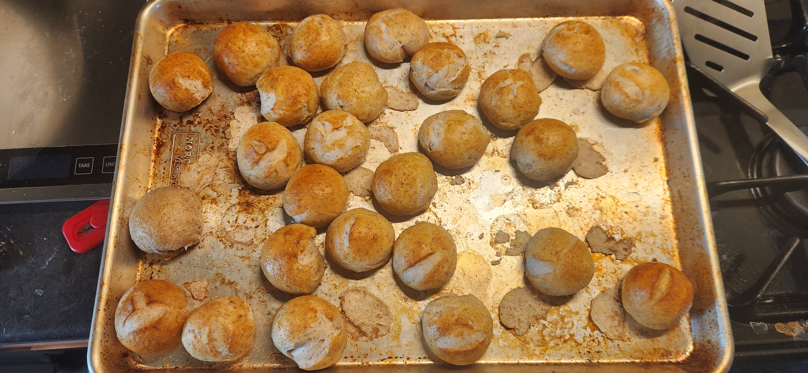

# Bake: Potluck pretzel bites

An experiment to figure out something that works better for a large group. This would be the first attempt at making pretzel bites. I am using <https://www.pantrymama.com/sourdough-discard-pretzel-bites/> as a rough guideline but am modifying it a bit. I have done something similar in the past making pretzels.

Turned out well. Maybe a bit salty but I suppose they are pretzels.

Roughly 65f inside

## Ingredients

| Ingredient            | Amount | Bakers Percentage | Comment                  |
| --------------------- | ------ | ----------------- | ------------------------ |
| [Bread flour](../642) | 475g   | 100.0%            |                          |
| [Turkey red](../739)  | 27g    | 100.0%            | I ran out of bread flour |
| Water                 | 300g   | 60.00%            |                          |
| [rye starter](../741) | 125g   | 20.00%            | 100% hydration, fed      |
| Salt                  | 10g    | 02.00%            |                          |

Total weight is approximately 865g.

## Time log

- 2025-04-09 08:45 Mixed [starter](../741)
- 2025-04-09 12:24 [Autolyse](../911) flour and water
- 2025-04-09 13:50 Mixed the rest of the ingredients
- 2025-04-09 23:00 Placed in the fridge
- 2025-04-10 13:29 Baked at 400f. Took like 30 minutes of work to shape, 20s boil, and egg wash. Baked for 22m. 21m is perfect for 30g-35g balls.
